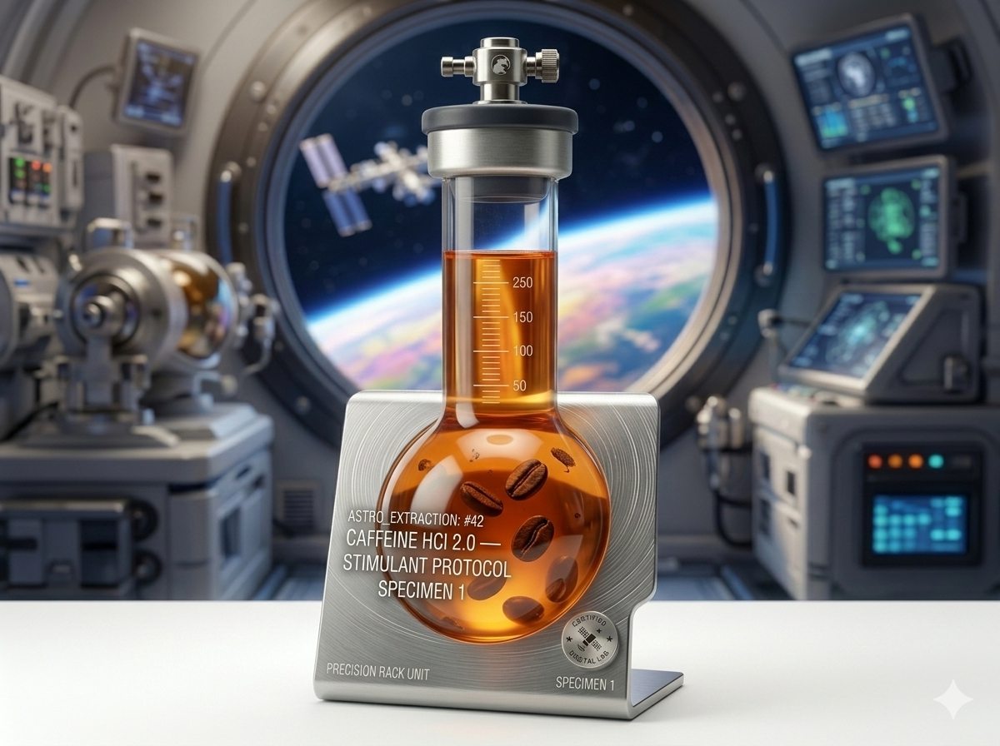

# 🦫 Space Beaver Coffee

Site web fictif d'un café scientifique orbital — projet HTML/CSS/JS pur, sans framework.

---

## Structure du projet

```
space-beaver/
│
├── index.html          # page d'accueil
├── menu.html           # catalogue des formules (boissons, pâtisseries, fast food)
├── crew.html           # présentation de l'équipage
├── contact.html        # formulaire de contact + FAQ + coordonnées
│
├── css/
│   └── style.css       # feuille de style principale (variables, thème, composants)
│
├── js/
│   └── main.js         # script principal (mode jour/nuit, burger, formulaire...)
│
└── assets/
    └── images/         # portraits PNG de l'équipage + icônes produits
```

---

## Fonctionnalités

**Mode jour / nuit**
Bascule entre un thème bleu scientifique (jour) et un thème violet néon (nuit). Le choix est sauvegardé dans `localStorage` pour persister entre les pages. Chaque page a un contenu différent selon le mode (produits, textes, ambiance).

**Responsive mobile**
Menu burger animé en dessous de 768px. Les grilles de cartes passent automatiquement de 4 colonnes à 2 puis 1 selon la largeur. La navbar reste fixe et garde un effet verre dépoli.

**Animations au scroll**
Les éléments avec la classe `reveal` apparaissent en fondu quand ils entrent dans le viewport, via `IntersectionObserver`.

**Effet glitch**
En mode nuit, les titres de section ont un effet de bug visuel avec `::before` / `::after` en CSS et `data-text` renseigné par le JS.

**Particules**
En mode nuit, des points lumineux violet/cyan flottent dans le hero, créés dynamiquement et supprimés après 7 secondes.

**Formulaire de contact**
Validation côté client : champs obligatoires, format email, longueur minimum. Message de succès simulé avec `setTimeout`. Pas de backend.

**FAQ accordéon**
Clic sur une question → la réponse se déplie avec une animation `max-height`. Une seule réponse ouverte à la fois.

---

## Système jour / nuit

La bascule repose entièrement sur la classe `.dark-mode` ajoutée au `<body>` par le JS.

```css
/* variables jour : définies dans :root */
:root { --accent: #1a6bdc; }

/* variables nuit : écrasent :root quand dark-mode est actif */
body.dark-mode { --accent: #b026ff; }
```

Pour le contenu HTML alternatif, j'utilise deux wrappers :

```html
<div class="day-content">   <!-- visible en mode jour, caché en nuit -->
<div class="night-content"> <!-- caché en mode jour, visible en nuit -->
```

Pour les grilles, j'utilise `display:contents` sur les wrappers pour que les cartes s'insèrent directement dans la grille parente sans casser le layout.

---

## Fallback images PNG

Toutes les images utilisent `onerror` pour afficher un emoji si le fichier PNG est absent :

```html

<span class="card-emoji-fb">🧪</span>
```

Quand `.img-error` est ajouté, le CSS cache l'image et rend l'emoji visible.

---

## Images attendues

| Fichier | Page | Utilisation |
|---|---|---|
| `hero-lab-day.png` | index | fond hero mode jour |
| `hero-lab-night.png` | index | fond hero mode nuit |
| `concept-day.png` | index | section concept mode jour |
| `concept-night.png` | index | section concept mode nuit |
| `castor-nova.png` | crew | portrait #001 jour |
| `prof-lignine.png` | crew | portrait #002 jour |
| `fibra-7.png` | crew | portrait #003 jour |
| `analyste-orbit.png` | crew | portrait #004 jour |
| `dr-beaverstein.png` | crew | portrait #X01 nuit |
| `dark-lignine.png` | crew | portrait #X02 nuit |
| `agent-beta42.png` | crew | portrait #X03 nuit |
| `shadow-fibra.png` | crew | portrait #X04 nuit |
| `icon-caffeine.png` | menu | boisson Caféine HCl |
| `icon-matcha.png` | menu | boisson Matcha BioSynth |
| `icon-vitality.png` | menu | boisson Sérum Vitalité |
| `icon-adaptogen.png` | menu | boisson Infusion Adaptogène |
| `icon-cookie-anxio.png` | menu | pâtisserie Cookie Anxiolytique |
| `icon-brownie-gravity.png` | menu | pâtisserie Brownie Gravité Zéro |
| `icon-tarte-photon.png` | menu | pâtisserie Tarte Photon |
| `icon-muffin-omega.png` | menu | pâtisserie Muffin Oméga-3 |
| `icon-burger-beta.png` | menu | fast food Burger Beta |
| `icon-tacos-lacto.png` | menu | fast food Tacos Lacto-Free |
| `icon-pizza-nutri.png` | menu | fast food Pizza Nutriplex |

Toutes les images ont un fallback emoji — le site fonctionne sans aucun de ces fichiers.

---

## Polices utilisées

Chargées depuis Google Fonts :

- **Orbitron** — titres, logos, valeurs chiffrées
- **Space Mono** — labels, badges, boutons, code
- **Rajdhani** — corps de texte courant

---

## Tester en responsive

Ouvrir les DevTools (`F12`), cliquer sur l'icône 📱, puis tester :

| Largeur | Résultat attendu |
|---|---|
| 1280px+ | grilles 4 colonnes, navbar complète |
| 1100px | grilles boissons/pâtisseries → 2 colonnes |
| 768px | burger menu, grilles 1 colonne, concept 1 colonne |
| 375px | affichage mobile complet |